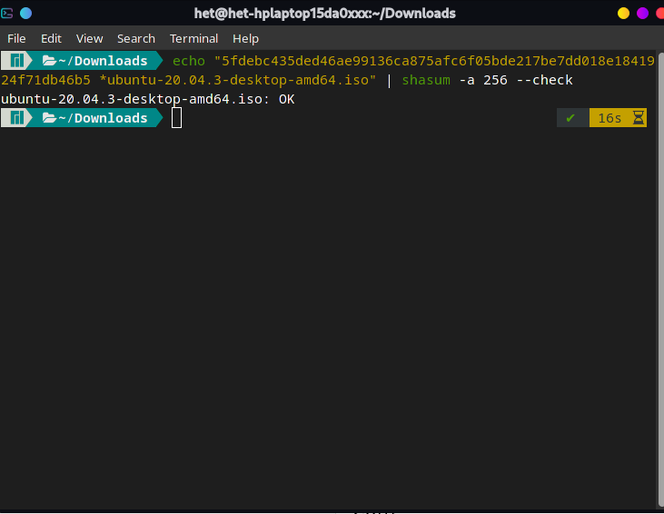
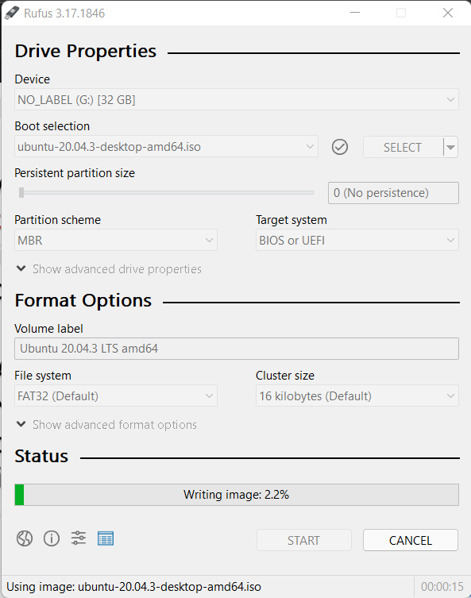
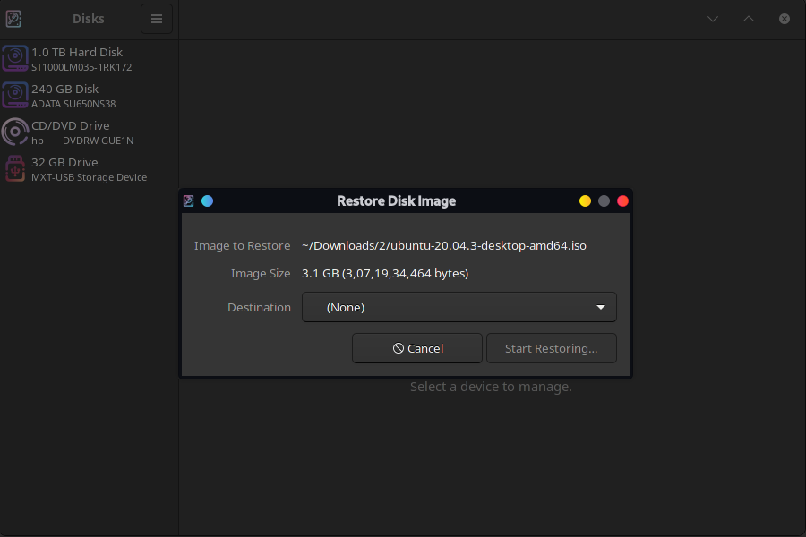
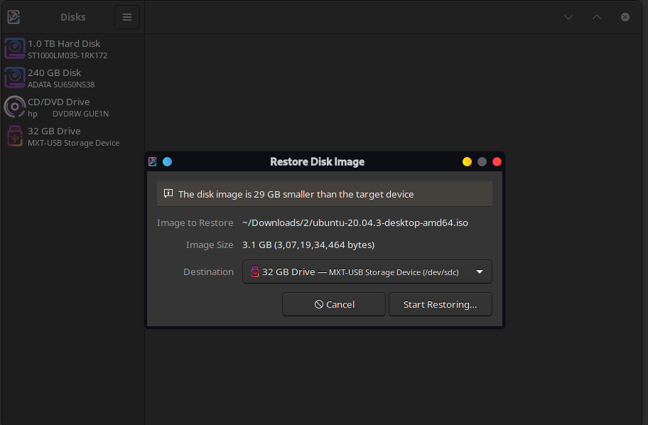
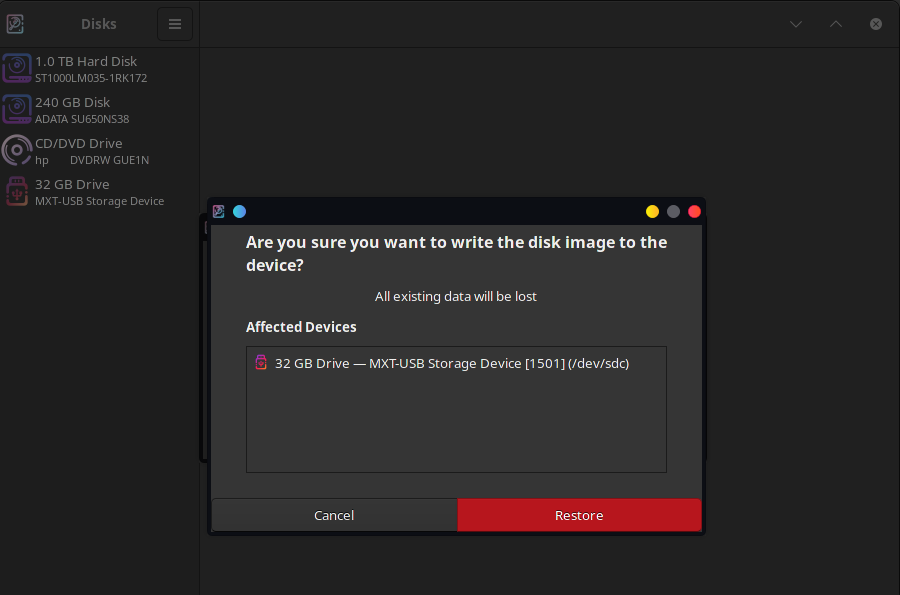
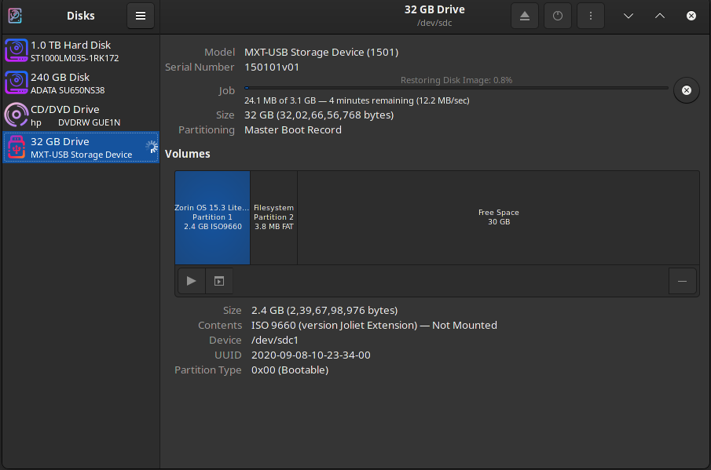
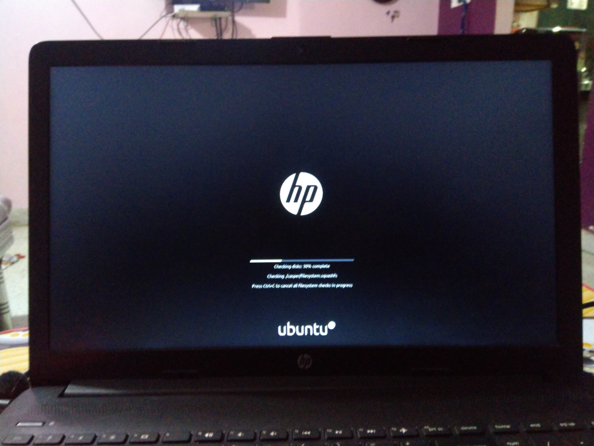
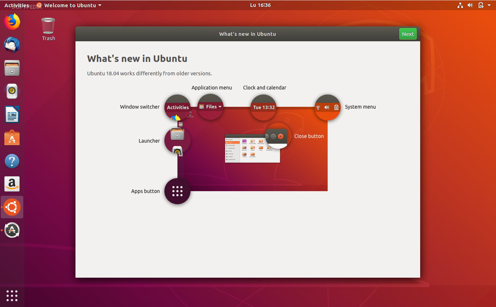

# Through ISO 

You can also follow the guide from [Ubuntu website](https://ubuntu.com/tutorials/install-ubuntu-desktop#1-overview) here

Steps:
1. Download ISO and hash File.
2. Burn the ISO into a USB stick.
3. Boot in the USB stick.

## Download ISO and hash File

- We will go the [Ubuntu website](https://ubuntu.com/download/desktop/thank-you?version=20.04.3&architecture=amd64) to download the ISO file and the hash file.

- You have to click on the button under Ubuntu Desktop option.
- You can choose to download LTS version for long-term updates or the latest version if you want to frequently change the OS.

- This would take you the Thank you page. 
- Now click on the verify download to the download.

- It should open a command like this.
- You can run this on the terminal to verify if the download is done properly or the file is corrupted. If it says ok, then the file is downloaded properly.

- Note: You have to open terminal at the location where Ubuntu ISO is downloaded.

## Burning the ISO to a USB stick.

- <b>On Windows:</b> You need to use [Rufus](https://rufus.ie/en/)

 

- Download Rufus and open it.
- Now the Rufus will open, it can ask you for the permission so just give that.

- Now you need to select your USB, select ISO option and select the ISO file.

- Note: Select DD image and not ISO image.

- It should start the writing work now.

- <b>On Linux:</b> You have the utility already.
- You have to right click and open the Disk Image writer.

- It should look something like this.
- Now select the drive where you want to install the Ubuntu.
- Note: Be sure that you do not use the hard drive or ssd on your device.

- Note: Also see that this process will format entire USB so keep necessary data back up before doing this.

- Now click on start restoring and you are done.

## Installing Ubuntu

- Now you have to boot into the bootable USB after this to install Ubuntu.
- In my case it was booting and constantly pressing F9 key to go in bootable menu.
- In your case it may be a little different.
- After that, select your USB stick.

- Now the Installation drive is booted and it should show you options to try Ubuntu and INstall Ubuntu.

- Now, I recommend you to go in try Ubuntu and not directly install Ubuntu because you can use the OS while installing the Ubuntu.
- This will help you when you get stuck.
- You can have a look for the problem in the browser or other software.

- Now we have to select the language and the keyboard layout.

- Now you can connect to the WiFi but it is completely ok if you do not connect to the internet. The installation does not need internet unless you want to update and install Ubuntu.

- I am choosing not to connect WiFi right now.

- I recommend you to Check the Third party dricvers checkbox.
- This will allow Ubuntu to install proprietary drivers.
- You can go for normal install or minimal install depending on your choice.

- Now it will ask you to partition the drive.
- In case you have only SSD/HDD and only Windows installed on it, you can go with the first option.
- If you choose second option, it will wipe your entire drive.
- If you want to you can also for a manual partitioning but be careful when doing it.
- Check [Partition.md](./Partition.md) for more.

- Now enter your usernmae and password.

- Now, it will start to install Ubuntu on your device.
- It will take some time and after completion, it will tell you to restart your computer.
- And that's it. We have installed the Ubuntu.

## Post Installation

- Now that you have installed Ubuntu, you should install some necessary software and other things.

- <b>Installing some necessary things:</b>

1. Open Software and Updates in Ubuntu:

- The first four options should be selected here.
- It will allow you to download all the softwares that Ubuntu offers.

- In your case, there will be first two options here can you have to check for the Canonical Partners.

- Now if you have a GPU, install proprietary drivers for the GPU. Prefer to use tested drivers.
- It is on Open source drivers by default which are less efficient.
- And click on apply changes.

2. Now go to the terminal and type these commands

        sudo apt update
        sudo apt install ubuntu-restricted-extras

- Ubuntu-Restricted-Extras is a bunch of codes that allow you to see videos on Ubuntu.
- You can use apt package manager to install from the Ubuntu software repositries.
- You can also preload if you have more ram(8 or more).
- Preload helps you load the frequently used apps in ram before hand to speed up the system. 
- Preload should not be used for system with 4GB or lower RAM.

        sudo apt install preload

- Now you can restart the Ubuntu.

- Note: I have customized the Ubuntu a little and that's why it looks different. In your case it would be like this: 

- You can customize the Ubuntu using Settings on top-right, [gnome-tweak-tool](https://itsfoss.com/gnome-tweak-tool/) and [dconf-editor](https://wiki.gnome.org/Apps/DconfEditor).
- Be careful when using Dconf-editor as you can mess up things.
- Customizations that I have done:
1. Used Dark theme:

- I have switched the dock to the bottom and used auto-hide on it with dark theme.

2. Button-layout to the left:

- This is dconf-editor.

3. Downloading some extensions:

- You can see the list of available extensions here.
- I recommend you installing appindicator if it is not there by default.
- Appindicator allows the app indicators to work on the top bar.
- This is needed for the softwares like OBS-studio, telegram etc.

- You can turn on the extensions with extensions app.
